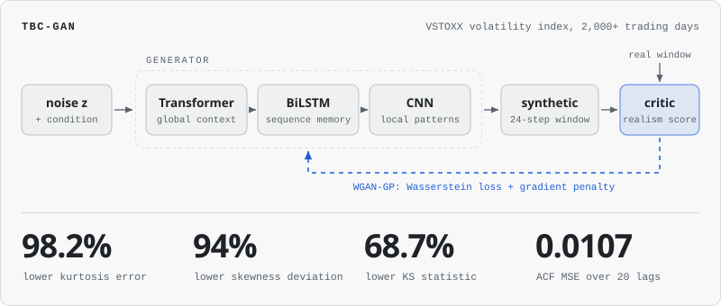
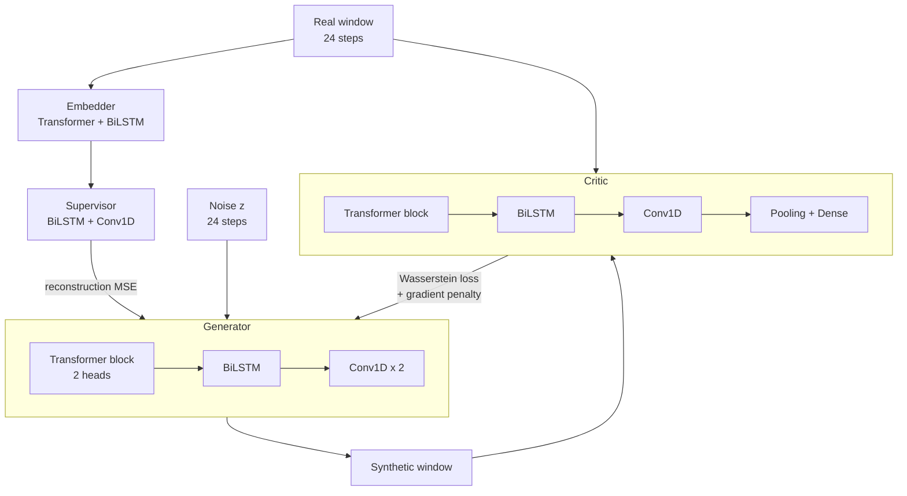

# TBC-GAN: Synthetic Financial Time Series

A Transformer-based conditional GAN that generates synthetic volatility series which keep the statistical character of real markets: heavy tails, volatility clustering and autocorrelation. Trained on the VSTOXX (EURO STOXX 50 volatility) index.

`TensorFlow` `Keras` `WGAN-GP` `Transformer` `BiLSTM` `CNN` `statsmodels`

<p>
<picture>
  <source media="(prefers-color-scheme: dark)" srcset="docs/fig-tbcgan-dark.svg">
  
</picture>
</p>

## The problem

Risk analysis, stress testing and strategy evaluation all need many plausible market scenarios, and history provides exactly one. Forecasting models estimate the next value. They are not built to produce alternative paths.

A generator for this job has to get more than the average right. Real volatility series show:

- **Heavy tails.** Extreme moves happen far more often than a normal distribution allows.
- **Volatility clustering.** Turbulent days follow turbulent days.
- **Dependence at several horizons.** Short-term fluctuations sit on top of long-range memory.

A model can match the histogram of real data and still produce paths no market would trace. So this project is evaluated on distributional and temporal fidelity, not point-wise error.

## Architecture

Four networks are trained together. The generator and critic play the adversarial game, and an embedder and supervisor add a supervised signal in the style of TimeGAN.



Each block in the generator sees the sequence differently:

| Block | What it captures |
| --- | --- |
| Transformer (self-attention) | Global dependencies: any step can attend to any other |
| BiLSTM | Temporal memory in both directions along the window |
| CNN (Conv1D) | Local structure and short-term fluctuations |

**Why WGAN-GP.** A standard GAN loss is unstable on small financial datasets and prone to mode collapse, where the generator produces one kind of path. The Wasserstein loss gives the generator a useful gradient even when the critic is ahead, and the gradient penalty, computed on interpolations between real and synthetic windows, keeps the critic well behaved.

**Why the supervised term.** The embedder and supervisor learn to reconstruct real windows, and their reconstruction error is added to the generator's loss. That pulls the generator toward the step-to-step dynamics of real data, which adversarial feedback alone learns slowly.

### Training configuration

Values from `code.py`:

| Setting | Value |
| --- | --- |
| Observations | 2,206 daily index values |
| Scaling | Min-max to [0, 1] |
| Window length | 24 steps, sliding by one |
| Hidden size | 16 |
| Attention | 2 heads, feed-forward size 32, dropout 0.2 |
| Batch size | 128 |
| Epochs | 1,000 |
| Critic updates per generator update | 5 |
| Generator loss | Wasserstein term + 10 x supervised MSE |
| Critic loss | Wasserstein term + 2 x gradient penalty, with weights clipped to [-0.01, 0.01] |
| Optimiser | Adam, learning rate 0.001, beta1 0.5 |
| Seeds | TensorFlow and NumPy fixed at 42 |

## Evaluation

Every metric compares generated windows with real ones. Lower is better for all four.

| Metric | Question it answers |
| --- | --- |
| Kolmogorov-Smirnov statistic | Do the two value distributions match? |
| Skewness difference | Is the asymmetry the same? |
| Kurtosis difference | Are the tails as heavy as the real ones? |
| ACF mean squared error | Is the autocorrelation structure preserved across lags? |

The script also fits an AR(2) process to the same data, simulates the same number of windows from it, and reports all four metrics for both models side by side. It then plots the value densities, the autocorrelation functions and a sample path for real data, TBC-GAN and AR(2).

## Results

Against the baseline:

| Measure | Result |
| --- | --- |
| Kurtosis error | **98.2%** lower |
| Skewness deviation | **94%** lower |
| KS statistic | **68.7%** lower |
| ACF MSE over 20 lags | **0.0107** |

Kurtosis and autocorrelation are where synthetic market data usually fails. Getting the tails and the memory right is what makes generated scenarios usable for risk work.

## Running it

```bash
pip install tensorflow pandas numpy scikit-learn scipy statsmodels matplotlib seaborn
python code.py
```

The script expects a CSV named `gandataEUROSTOXX.csv` with a numeric column called `Indexvalue`. The dataset is not included in the repository. The path is set near the top of `code.py` through `csv_path`, so point it at your copy before running.

A run prints losses every 200 epochs, then the comparison table, then shows the three plots.

## What is in this repository

`code.py` is the reference run in a single file: data preparation, the four networks, the WGAN-GP training loop, the AR(2) baseline, the metrics and the plots, with one fixed configuration.

Not in this file yet:

- The Optuna hyperparameter search
- The conditioning inputs
- A dataset loader that uses a relative path

## Applications

- Risk analysis and stress testing with scenarios beyond the historical record
- Portfolio simulation and Monte Carlo studies
- Data augmentation for models trained on scarce market data
- Strategy evaluation on paths the strategy has not been fitted to

## Related

[volatility-insights](https://github.com/Yogdeep2004/volatility-insights) is a companion dashboard that walks through the architecture and the model comparison.

---

Built by [Yogdeep Benchimath](https://github.com/Yogdeep2004). More work on the [portfolio](https://deepwork-systems.vercel.app/).
